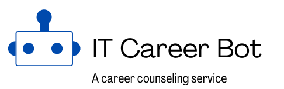
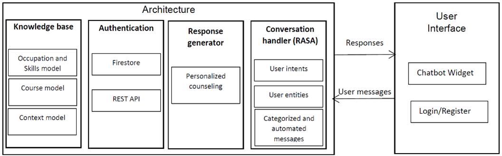

# IT Career Bot - A Personalized Career Counseling Chatbot

IT Career Bot is a project for desmontrating how to build a personalized chatbot based on context-aware knowledge base. The chatbot can help students know how to prepare for a new career by providing dynamic learning paths according to user interest and profile.

The source code is structured as the below:
* **api-server**: Contains Python scripts to run Flask application for serve user requests.
* **chat-widget**: A ReactJS applications provide an interface that allows user can text and get response from the chatbot.
* **ontology**: Contains raw data that is collected from different sources (Ex. Edx, Coursera, ...) and scripts for creating career counseling ontology.
* **survey-analysis**: Contains raw data that is questions is collected from social networks (Quora, Stack overflow, Stack exchange) to understand what user demand need to in a career counseling service. 
* **rasa**: Contains pipeline configuration and dialog management for intent classification and entity extraction.
# Installation
## Application architecture

The chatbot architecture consists of 3 main components: 
* **Conversation handler** is implemented by using Rasa pipeline for intent classification and entity extraction.
* **Response generator** is the component that generates response based on user contexts and domain knowledge.
* **Knowledge base** represents entities related to career counseling services such as occupation and associated skills, courses and users contexts. 
## Environment requirement
1. Virtual environment
  * We use Anaconda (https://www.anaconda.com/) to create an isolated virtual environment for interpreting and executing Python scripts. It also provides many modules and libraries to enable a flexible approach when programming chatbot functions.

2. Flask (https://flask.palletsprojects.com)
  * A Python web framework allows create production in a short time without considering the low level of web programming. 
3. Firestore communication
  * We use Firebase-admin (https://pypi.org/project/firebase-admin/) module to query and retrieve data from Firestore (A No SQL cloudd database is developed by Google)
4. Owlready2 (https://owlready2.readthedocs.io/en/v0.34/)
  * This Python library provide many functions to create, update and query on an ontology. We recommend use version 0.34 to avoid conflicting in the setup process.
## How to run the chatbot application?
* Step 1. Execute Rasa component by using the below command:
```
rasa run --enable-api --cors "*" --port 5005 --debug --credentials credentials.yml
```
* Step 2. Running Rasa action server to serve single actions for each request from dialog management
```
rasa run actions
```

* Step 3: Running the Flask server to handle user requests
```
flask run
```
